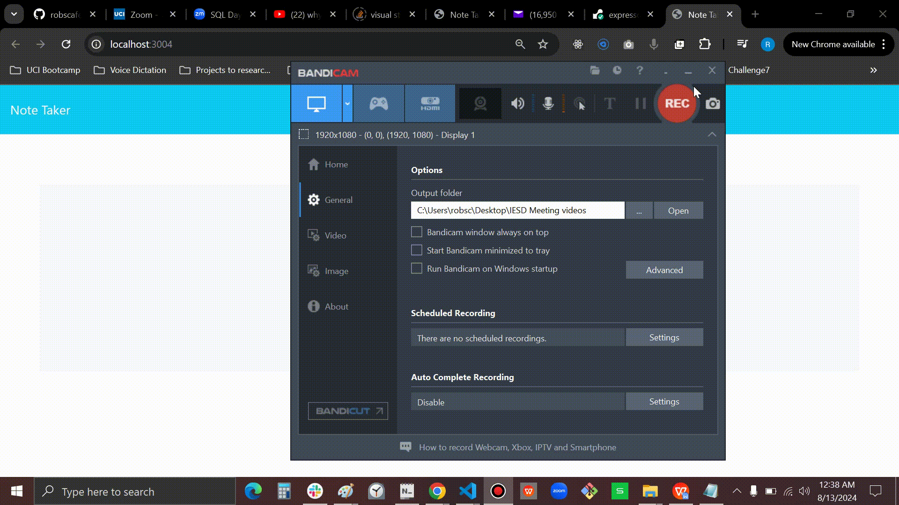

# My Daily Notes

## Notes Tracker

The motivation for this project was to practice making and connecting routes using express.js

I learned how implementing the use of the following functions:

 creaing GET, POST, DELETE routes using express.js and json database.

## Table of Contents

1). My Daily Notes webpage.

## Usage

render  url: https://expresschallengehw.onrender.com

Github repository: https://github.com/robscafe433/My-Daily-Notes

Webpage GIF:

   

## Badges

